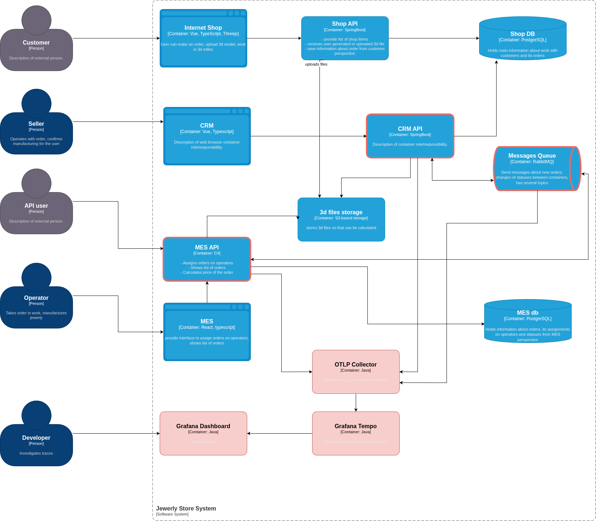

# Архитектурное решение по трейсингу
## Обзор

Трейсингом следует покрыть взаимодействие *MES API* и *CRM API* через *RabbitMQ*. Именно этот сложный маршрут наиболее подвержен сбоям в виду низкой производительности и устойчивости *MES API*. Кроме того, запрос на создание заказа и расчета его стоимости проходит все эти три системы, и обнаружить где конкретно произошел сбой без трейсинга -- задача довольно сложная. 

Все остальные взаимодействия, такие как *Shop API* -> *Shop DB*, *CRM API* -> *Shop DB* и т.д. трейсингом покрывать не нужно, потому что обнаружить ошибку будет довольно легко по логам, если они разработаны правильно. Трейсинг хорош там, где взаимодействуют несколько сервисов, и один пользовательский запрос обрабатывается несколькими процессами. В случае если это только взаимодействие с БД или другим хранилищем (например, *Shop API* -> *Shop DB*), трейсинг выглядит избыточны.м

## Мотивация
Когда клиент жалуется на задержку, команда тратит слишком много времени, чтобы вручную проверить логи в каждой системе и понять, где именно произошел сбой, застрял заказ. Это неэффективно и слишком долго, при этом клиенты всё ещё ждут свои заказы и продолжают жаловаться.

Внедрение распределенной трассировки предоставит единое окно видимости (single pane of glass) для всего жизненного цикла заказа. Мы сможем в реальном времени отслеживать путь каждого заказа от создания до отправки, мгновенно находить узкие места и причины сбоев. Это превратит реактивный подход ("клиент пожаловался — ищем проблему") в проактивный ("система сама сообщила об аномалии — мы исправили до того, как это заметил клиент").

## Предлагаемое решение

Необходимо воспользоваться OpenTelemetry для сбора телеметрии (для трейсинга) и Grafana Tempo в качестве бэкенда для хранения и анализа трассировок. Для отображения данных можно воспользоваться Grafana Dashboard. Данные технологии широко используются в индустрии, являются открытыми и независимыми от вендора.
Для того, чтобы выбранные сервисы начали отправлять трейсы в OTLP Collector, необходимо добавить инструментацию в виде дополнительных библиотек и, возможно, добавления кода конфигурации.

## Компромиссы

1. Накладные расходы на производительность. Инструментация слегка снизит производительность системы, что может быть заметно во время пиковых нагрузок.
2. Трейсы нужно где-то хранить, что добавляет расходы на хранилище.
3. Потребуется некоторое изменение в кодовой базе сервисов.
4. Трейсинг не принесет никакой пользы в тех случаях, когда в сценарии использования есть всего один микросервис, даже если он общается с БД или брокером. Дело в том, что трейсинг полезен для отслеживания жизненного цикла запроса, проходящего через несколько микросервисов, т.е. там, где сложно найти точку отказа по одним лишь логам.
В случае, если микросервис один, исследования логов будет достаточно.
5. Трейсинг трудно внедрить в проприетарные системы. В данном учебном примере их нет, поэтому этот компромис здесь не рассматриваем.

## Безопасность

- Доступ к UI Grafana Tempo должен быть только у команды поддержки или разработчиков. Доступ должен быть интегрирован с корпоративной системой аутентификации (например, через OAuth2/OIDC).
- Grafana Tempo и OpenTelemetry Collector должны быть развернуты в приватной подсети  сети (private subnet) и не быть доступны из интернета.
Весь трафик между приложениями, коллектором и бэкендом должен быть идти по SSL.
- Трейсы могут содержать чувствительную информацию в логах. В OpenTelemetry Collector можно настроить процессоры для маскирования или удаления таких данных перед отправкой в хранилище. Например, можно удалять или хэшировать персональные данные клиентов.
