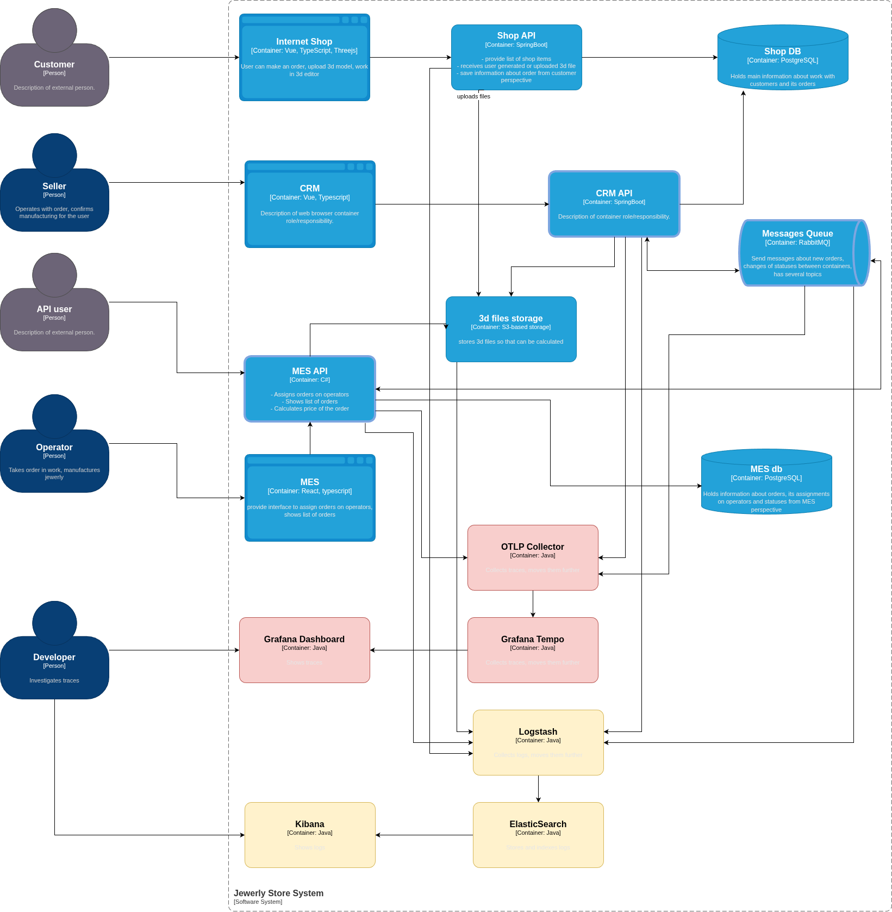

# Архитектурное решение по логированию
## Обзор

Логи будем собирать все, какие производят наши сервисы, БД, брокер и файловое хранилище. Однако, если нас интересует не технические детали, а логика предметной области, то следующие процессы будут важны для поиска точки сбоя.

1. Аутентификация.
2. Создание, просмотр, обновление, удаление заказа.
3. Рассчет стоимости заказа (начат, закончен успешно, закончен с ошибкой).
4. Статус заказа изменен (создан, назначен оператору, выполнен, ошибка и т.д.).

Все эти логи проходят по уровню INFO и должны содержать следующие данные.

1. Service name
2. Service Instance ID
3. User ID
4. Время создания лога
5. ID заказа.
6. Статус операции.
7. Прочая дополнительная информация, human readable сообщение.
8. Trace ID

Наибольший интерес представляют логи из сервисов:

- Shop API
- CRM API
- MES API

Прочие уровни логгирования:

- WARN: ситуация, которая не является ошибкой, но является нештатной и требует внимания. Система продолжает работать, но это может привести к проблемам в будущем.
- ERROR: произошла ошибка, которая не позволила завершить конкретную операцию. Приложение в целом продолжает работать, но задача (например, расчет стоимости для одного заказа) провалена.
- DEBUG: подробная информация, полезная только разработчикам для диагностики сложных проблем. В продакшене этот уровень должен быть отключен, чтобы не засорять систему и не нести лишние расходы на хранение.
- FATAL: катастрофическая ошибка, после которой приложение не может продолжать работу и завершается. Например, не удалось подключиться к базе данных при старте. Такие логи должны немедленно генерировать алерт.

## Мотивация

Логгирование крайне важно для расследования причин и последствий сбоев в системе. Следующие сценарии использования логов наиболее важны:

- В случае сбоя обработки заказа на любом из этапов необходимо разобраться, что послужило причиной сбоя и внести исправления или в код сервиса, или в инфраструктуру. Именно логи дадут достаточно информации для понимания, что и где произошло. Если программисту придется вносить изменения в исходный код сервиса, то при помощи логов инженер сможет смоделировать ситуацию, которая может произойти только в продакшене и никогда не повторится в тестовом окружении.

- В результате сбоя на каком-либо из этапов обработки заказа сам заказ может оказаться в несогласованном состоянии (пример: физически заказ выполнен, но в БД состояние всё еще MANUFACTURING_STARTED). В такой ситуации возможно придется вручную вносить коррективы в данные системы. Но для этого нужно точно восстановить картину произошедшего сбоя, и именно в этом поможет подробная информация, полученная из логов.

- Исследование логов на наличие ошибок до того, как они повлияют на работоспособность всей системы, поможет повысить стаблильность системы и удовлетворенность пользователей.

- В случае, если пользователь обратится в техподдержку со своей проблемой, логи помогут выяснить во всех деталях, что произошло, а также помочь пользователю и решить его проблему.

- Логи помогут в решении споров с клиентами, если возникнет неоднозначная ситуация. Тогда из логов можно будет извлечь подробную информацию о всех действиях пользователя.

### Бизнес метрики

- Время выполнения заказа: можно получить точную аналитику по времени выполнения заказов и выявлять этапы, вызывающие наибольшие задержки.
- Время решения обращения в поддержку: по логам инженер техподдержки сможет быстрее решать проблемы.
- Логи будут фиксировать точное время получения и обработки заказов от партнеров, что поможет в случае споров о качестве работы системы.

### Технические метрики

Внедрение логгирования положительно повлияет на следующие технические метрики:

- MTTR (Mean Time To Resolution): Если сейчас на поиск причины уходит часы или дни, то с логами, связанными с трейсами, это время сократится до минут.

-Error Rate by Component (Уровень ошибок по компонентам): Мы сможем точно считать количество ERROR-логов в каждом сервисе (Shop API, MES, CRM). Это позволит объективно оценивать надежность каждого компонента и направлять ресурсы на разработку на самые нестабильные из них.

### Покрытие логами и трейсами

Логгирование в первую очередь нужно для следующих систем:

- Shop API
- CRM API
- MES API
- Rabbit MQ
- Файловое хранилище

Из логов от перечисленных системы мы сможем извлечь информацию как о бизнесовых сбоях, так и о технических.

Трейсинг нужно настроить только для тех систем, которые в своем взаимодействии реализуют один общий пользовательский сценарий:

- CRM API
- MES API
- Rabbit MQ

## Предлагаемое решение

Логирование через ELK-стек:

- Elasticsearch для хранения, индексирования логов и поску по ним.
- Logstash  для сбора и обработки перед отправкой в Elasticsearch.
- Kibana -- веб-интерфейс визуализации, поиска и анализа логов.
- Filebeat -- агент, который устанавливается на серверы приложений для отправки логов в Logstash.

Как это всё будет работать:

1) На каждый инстанс с Shop API, CRM Backend и MES Backend устанавливается Filebeat. Он отслеживает лог-файлы и отправляет их в Logstash.
2) Logstash получает логи, выполняет ключевую работу:
- Парсит JSON-логи.
- Обогащает их метаданными (имя сервиса, окружение).
- Маскирует чувствительные данные перед отправкой в Elasticsearch.
- Добавляет trace_id для связи с трейсингом.
3) Обработанные логи сохраняются в Elasticsearch, который создает для них индексы для быстрого поиска.
4) Инженеры и поддержка работают с логами через Kibana, строя дашборды и выполняя поисковые запросы.

Для безопасности доступа к логам следует настроить аутентификацию и ролевую модель. Например, разработчики смогут видеть все логи, а инженеры техподдержки -- только специально настроенные для них дашборды.

## Мероприятия для превращения системы сбора логов в систему анализа логов

Базовые уведомления:

- Настроить Kibana Alerting на критические ERROR логи в приоритетных системах (MES, Shop API).
- Настроить алерт на превышение пороговых значений для ключевых бизнес-метрик (например, время расчета стоимости > 35 минут).
- Определить каналы уведомлений (Slack, email) и дежурных инженеров поддержки.

ML-уведомления:

- Включить модуль Elasticsearch Machine Learning.
- Создать первые ML-задачи для анализа:
  * Частоты логов по уровням (INFO, WARN, ERROR) для каждого сервиса.
  * Аномалии в поле duration_ms из логов MES.
  * Аномалии в количестве запросов к Shop API.

## Критерии для выбора технологии для работы с логами

| Критерий                         | ELK                                                                                             | OpenSearch                                                                        | Splunk                                                                                                          | Grafana Loki                                                                                                                         |
|----------------------------------|-------------------------------------------------------------------------------------------------|-----------------------------------------------------------------------------------|-----------------------------------------------------------------------------------------------------------------|--------------------------------------------------------------------------------------------------------------------------------------|
| Лицензия                         | Elastic License (SSPL)                                                                          | Apache License 2.0                                                                | Проприетарная (коммерческая)                                                                                    | AGPLv3                                                                                                                               |
| Стоимость владения (TCO)         | Высокая. Elasticsearch требователен к RAM и CPU. Требуется эксперт для настройки и оптимизации. | Высокая. Архитектурно очень похож на Elasticsearch, схожие требования к ресурсам. | Очень высокая. Стоимость лицензии (часто за ГБ) + мощное железо.                                                | Низкая/Средняя. Значительно меньше потребляет ресурсов. Использует дешевое объектное хранилище.                                      |
| Гибкость запросов                | Высокая. KQL/Kibana Query Language и Lucene. Очень мощный для ad-hoc поиска по тексту.          | Высокая. Аналогично ELK, использует KQL.                                          | Очень высокая. SPL (Search Processing Language) считается "золотым стандартом" для анализа и обогащения данных. | Средняя. LogQL похож на PromQL. Отлично работает со структурированными логами и фильтрацией по меткам. Поиск по тексту менее гибкий. |
| Экосистема и интеграция          | Сильная, но обособленная. Интегрируется с Grafana как источник данных.                          | Сильная. Совместим с экосистемой ELK.                                             | Огромная. Множество готовых приложений и дополнений внутри своей экосистемы.                                    | Нативная интеграция с Grafana. Идеально подходит для единого стека наблюдаемости (метрики, трейсы, логи в одном UI).                 |
| Архитектура и производительность | Инвертированный индекс. Полный текстовый поиск. Очень быстрый, но ресурсоемкий.                 | Инвертированный индекс. Аналогично ELK.                                           | Проприетарный индекс. Очень быстрый и зрелый, оптимизированный для анализа.                                     | Индексация по меткам (labels). Не индексирует текст сообщения. Низкая стоимость хранения и высокая скорость при фильтрации по меткам |

