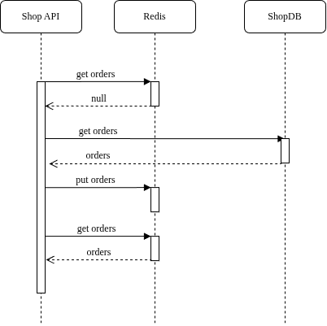
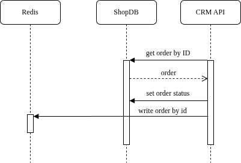

# Архитектурное решение по кешированию
## Обзор

1. Результаты расчета стоимости в MES
Расчет занимает много времени. Если пользователь повторно загружает тот же файл, можно воспользоваться закешированным результатом.

2. Данные для дашборда операторов в MES
Нужно кэшировать результаты запроса к базе данных, который формирует список заказов на главной странице. Операторы будут быстрее получать главную страницу.

3. Каталог готовых изделий в Онлайн-магазине
Кэшируем информацию о товарах и снимаем нагрузку с БД, которая ещё и в *CRM API* используется.

## Мотивация

Кэширование решит целый ряд проблем:

- Устранит главную причину задержек заказов, результаты расчетов для тех же файлов будут возвращаться мгновенно.
- Повысит эффективность операторов, потому что теперь UI будет работать значительно быстрее.
- Ускорит работу магазина для клиентов.
- Снизит нагрузку на инфраструктуру: разгрузит базы данных и вычислительные мощности MES.

Планируется включить в кеширование следующие компоненты системы:

- Результаты расчета стоимости в MES
- Данные для дашборда операторов в MES
- Каталог товаров в Онлайн-магазине.

## Предлагаемое решение

В качестве основного паттерна для внедрения серверного кеширования предлагается использовать Cache-Aside. Он самый простой в реализации, и команда сможет быстро добавить такое кэширование в существующий код без полной переработки кода.

Данный паттерн очень отказоустойчивый, т.к. в случае отказа кэша система всё равно продолжит правильно работать, хотя и заметно медленнее.

Для наших сценариев использования паттерн Cache-Aside хорошо подходит, т.к. он предназначен для тех ситуаций, когда количество запросов на чтение заметно превышает запросы на запись.

Почему другие паттерны не подходят или хуже:

- Write-Through -- у нас в основном чтение, запись кэшировать нет смысла, прироста производительности не будет.
- Refresh-Ahead -- реализовать сложнее, а кроме того у него -- заметная избыточность. Он будет постоянно заранее обновляться из БД, а у нас и так немалая нагрузка на сервисы.

### Инвалидация кеша

1. Для расчета стоимости в MES: временная инвалидация и программная инвалидация.

Мы устанавливаем долгий срок жизни для кеша (например, 7 дней). Если меняется логика расчета (например, цена на ресурсы производства), то система автоматически сбрасывает все кэшированные значения, чтобы расчеты выполнились заново с новыми данными.

2. Для дашборда операторов в MES: временная инвалидация.

Устанавливаем короткий TTL (15-30 секунд) для кешированных данных дашборда. Операторы видят изменения с небольшой задержкой, что допустимо для их работы, а нагрузка на базу данных снижается в десятки раз.

3. Для каталога товаров в онлайн-магазине: Инвалидация временная и программная инвалидация по ключу.

Мы устанавливаем очень длинный TTL (например, 24 часа). Но в момент, когда менеджер в админ-панели сохраняет изменения в товаре, приложение программно выполняет команду на удаление из кеша только этого конкретного товара по его ключу. Это обеспечивает максимальную производительность и мгновенную актуальность данных после их изменения, не затрагивая остальные товары в кеше.

